# 시스템 아키텍처 문서 (Architecture Document)

## 📋 문서 정보
- **프로젝트명**: 아르바이트 출퇴근 관리 시스템
- **버전**: 1.0.0
- **작성일**: 2025-10-02
- **문서 타입**: 시스템 아키텍처 설계

---

## 1. 아키텍처 개요

### 1.1 아키텍처 패턴
본 시스템은 **3-Tier 아키텍처**를 기반으로 설계되었습니다.

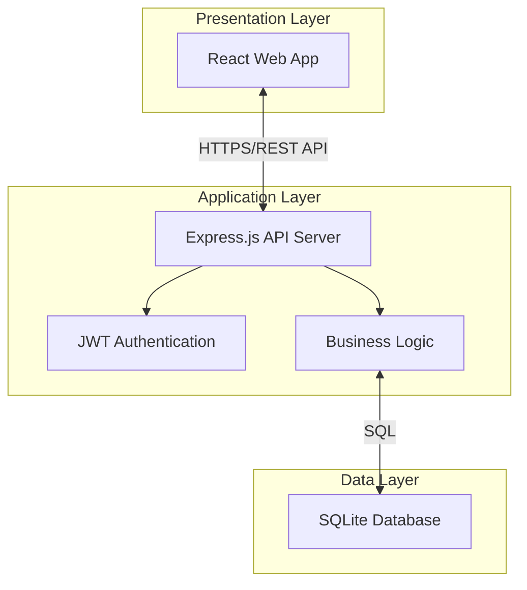
```mermaid
graph TB
    subgraph "Presentation Layer"
        A[React Web App]
    end
    
    subgraph "Application Layer"
        B[Express.js API Server]
        C[JWT Authentication]
        D[Business Logic]
    end
    
    subgraph "Data Layer"
        E[SQLite Database]
    end
    
    A <-->|HTTPS/REST API| B
    B --> C
    B --> D
    D <-->|SQL| E
```

### 1.2 설계 원칙
- **관심사의 분리 (Separation of Concerns)**: 프론트엔드, 백엔드, 데이터베이스 계층 분리
- **RESTful API**: 표준 HTTP 메서드를 사용한 API 설계
- **무상태성 (Stateless)**: JWT 기반 무상태 인증
- **확장성 (Scalability)**: 마이크로서비스로 전환 가능한 구조
- **보안 우선 (Security First)**: 모든 계층에서 보안 고려

---

## 2. 시스템 아키텍처

### 2.1 전체 시스템 구조

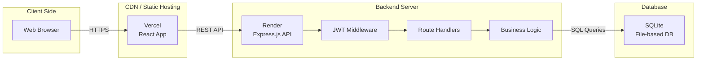
```mermaid
graph LR
    subgraph "Client Side"
        A[Web Browser]
    end
    
    subgraph "CDN / Static Hosting"
        B[Vercel<br/>React App]
    end
    
    subgraph "Backend Server"
        C[Render<br/>Express.js API]
        D[JWT Middleware]
        E[Route Handlers]
        F[Business Logic]
    end
    
    subgraph "Database"
        G[SQLite<br/>File-based DB]
    end
    
    A -->|HTTPS| B
    B -->|REST API| C
    C --> D
    D --> E
    E --> F
    F -->|SQL Queries| G
```

### 2.2 배포 아키텍처

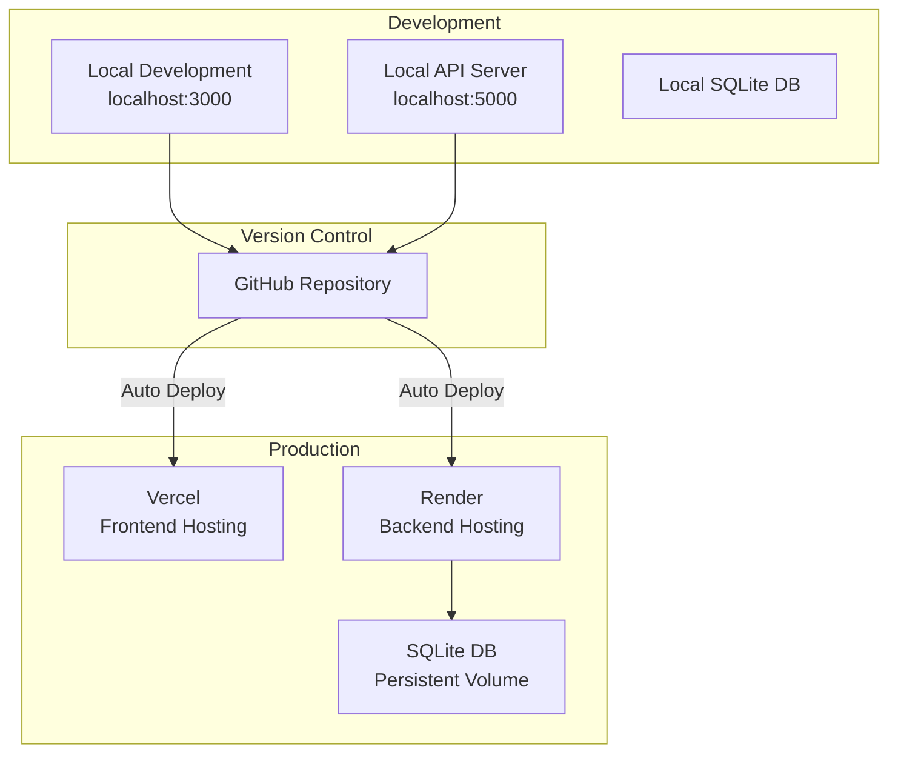
```mermaid
graph TB
    subgraph "Development"
        A[Local Development<br/>localhost:3000]
        B[Local API Server<br/>localhost:5000]
        C[Local SQLite DB]
    end
    
    subgraph "Production"
        D[Vercel<br/>Frontend Hosting]
        E[Render<br/>Backend Hosting]
        F[SQLite DB<br/>Persistent Volume]
    end
    
    subgraph "Version Control"
        G[GitHub Repository]
    end
    
    A --> G
    B --> G
    G -->|Auto Deploy| D
    G -->|Auto Deploy| E
    E --> F
```

---

## 3. 프론트엔드 아키텍처

### 3.1 컴포넌트 구조

```
src/
├── components/           # 재사용 가능한 컴포넌트
│   ├── common/          # 공통 컴포넌트
│   │   ├── Button.jsx
│   │   ├── Input.jsx
│   │   ├── Modal.jsx
│   │   └── Loading.jsx
│   ├── layout/          # 레이아웃 컴포넌트
│   │   ├── Header.jsx
│   │   ├── Sidebar.jsx
│   │   └── Footer.jsx
│   ├── staff/           # 알바생 전용 컴포넌트
│   │   ├── ClockInButton.jsx
│   │   ├── ClockOutButton.jsx
│   │   └── ShiftList.jsx
│   └── admin/           # 관리자 전용 컴포넌트
│       ├── ShiftApproval.jsx
│       ├── Statistics.jsx
│       └── UserManagement.jsx
├── pages/               # 페이지 컴포넌트
│   ├── LoginPage.jsx
│   ├── StaffDashboard.jsx
│   ├── AdminDashboard.jsx
│   └── NotFoundPage.jsx
├── hooks/               # 커스텀 훅
│   ├── useAuth.js
│   ├── useShifts.js
│   └── useApi.js
├── context/             # Context API
│   ├── AuthContext.jsx
│   └── ThemeContext.jsx
├── services/            # API 서비스
│   ├── api.js
│   ├── authService.js
│   ├── shiftService.js
│   └── adminService.js
├── utils/               # 유틸리티 함수
│   ├── dateFormatter.js
│   ├── timeCalculator.js
│   └── validators.js
├── constants/           # 상수
│   └── index.js
├── App.jsx              # 루트 컴포넌트
└── main.jsx             # 엔트리 포인트
```

### 3.2 상태 관리 구조

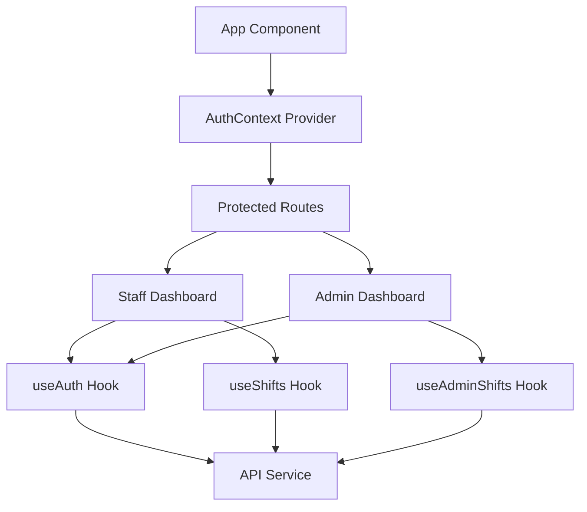
```mermaid
graph TD
    A[App Component] --> B[AuthContext Provider]
    B --> C[Protected Routes]
    C --> D[Staff Dashboard]
    C --> E[Admin Dashboard]
    D --> F[useAuth Hook]
    D --> G[useShifts Hook]
    E --> F
    E --> H[useAdminShifts Hook]
    F --> I[API Service]
    G --> I
    H --> I
```

### 3.3 라우팅 구조

```javascript
// 라우팅 구조
/                          → LoginPage
/staff/dashboard           → StaffDashboard (Protected)
/staff/shifts              → StaffShiftList (Protected)
/admin/dashboard           → AdminDashboard (Protected)
/admin/shifts              → AdminShiftManagement (Protected)
/admin/statistics          → AdminStatistics (Protected)
/404                       → NotFoundPage
```

---

## 4. 백엔드 아키텍처

### 4.1 디렉토리 구조

```
server/
├── src/
│   ├── config/              # 설정 파일
│   │   ├── database.js      # DB 연결 설정
│   │   ├── jwt.js           # JWT 설정
│   │   └── env.js           # 환경 변수
│   ├── middleware/          # 미들웨어
│   │   ├── auth.js          # JWT 인증
│   │   ├── errorHandler.js  # 에러 핸들링
│   │   ├── validator.js     # 입력 검증
│   │   └── logger.js        # 로깅
│   ├── routes/              # 라우트 정의
│   │   ├── auth.routes.js   # 인증 라우트
│   │   ├── shift.routes.js  # 출퇴근 라우트
│   │   └── admin.routes.js  # 관리자 라우트
│   ├── controllers/         # 컨트롤러
│   │   ├── authController.js
│   │   ├── shiftController.js
│   │   └── adminController.js
│   ├── services/            # 비즈니스 로직
│   │   ├── authService.js
│   │   ├── shiftService.js
│   │   └── adminService.js
│   ├── models/              # 데이터 모델
│   │   ├── User.js
│   │   └── Shift.js
│   ├── utils/               # 유틸리티
│   │   ├── bcrypt.js
│   │   ├── jwt.js
│   │   └── dateHelper.js
│   ├── validators/          # 입력 검증 스키마
│   │   ├── authValidator.js
│   │   └── shiftValidator.js
│   └── app.js               # Express 앱 설정
├── database/
│   ├── migrations/          # DB 마이그레이션
│   │   └── 001_initial.sql
│   └── seeds/               # 시드 데이터
│       └── users.sql
├── tests/                   # 테스트
│   ├── unit/
│   └── integration/
├── .env.example             # 환경 변수 예시
├── package.json
└── server.js                # 서버 엔트리 포인트
```

### 4.2 레이어드 아키텍처

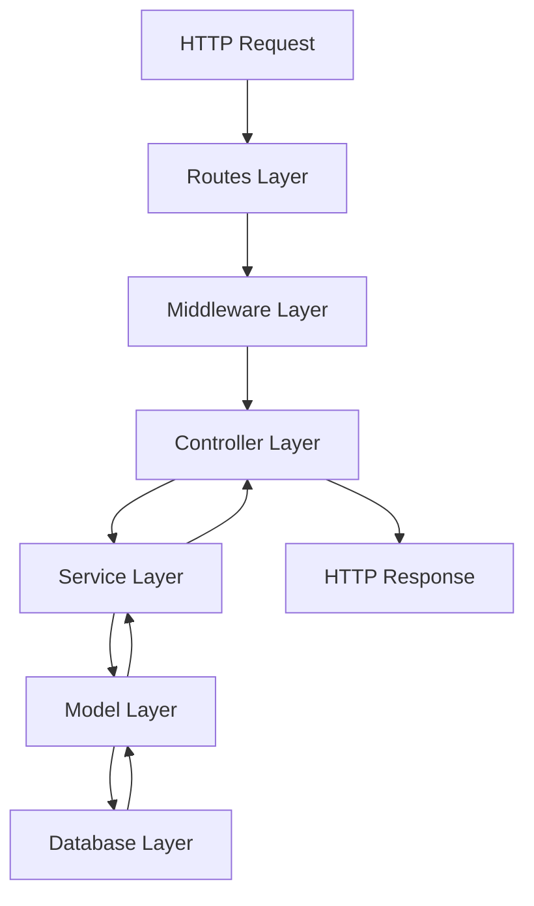
```mermaid
graph TD
    A[HTTP Request] --> B[Routes Layer]
    B --> C[Middleware Layer]
    C --> D[Controller Layer]
    D --> E[Service Layer]
    E --> F[Model Layer]
    F --> G[Database Layer]
    G --> F
    F --> E
    E --> D
    D --> H[HTTP Response]
```

**각 레이어의 역할**:
- **Routes**: API 엔드포인트 정의 및 라우팅
- **Middleware**: 인증, 검증, 로깅, 에러 핸들링
- **Controller**: HTTP 요청/응답 처리
- **Service**: 비즈니스 로직 구현
- **Model**: 데이터 접근 및 조작
- **Database**: 실제 데이터 저장소

### 4.3 API 엔드포인트 구조

```
/api
├── /auth
│   ├── POST   /login          # 로그인
│   ├── POST   /logout         # 로그아웃
│   └── GET    /me             # 현재 사용자 정보
├── /shifts
│   ├── POST   /clock-in       # 출근
│   ├── PUT    /clock-out/:id  # 퇴근
│   ├── GET    /my-shifts      # 내 근무 내역
│   ├── POST   /manual         # 수동 입력
│   └── PUT    /:id            # 근무 기록 수정
└── /admin
    ├── GET    /shifts         # 전체 근무 기록
    ├── PUT    /shifts/:id/approve   # 승인
    ├── PUT    /shifts/:id/reject    # 반려
    ├── GET    /statistics     # 통계
    └── GET    /users          # 사용자 목록
```

---

## 5. 데이터베이스 아키텍처

### 5.1 ERD (Entity Relationship Diagram)

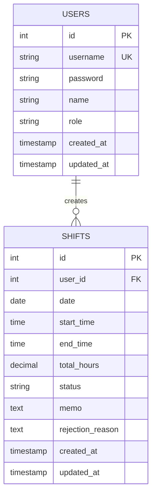
```mermaid
erDiagram
    USERS ||--o{ SHIFTS : creates
    USERS {
        int id PK
        string username UK
        string password
        string name
        string role
        timestamp created_at
        timestamp updated_at
    }
    SHIFTS {
        int id PK
        int user_id FK
        date date
        time start_time
        time end_time
        decimal total_hours
        string status
        text memo
        text rejection_reason
        timestamp created_at
        timestamp updated_at
    }
```

### 5.2 인덱스 전략

```sql
-- 성능 최적화를 위한 인덱스
CREATE INDEX idx_shifts_user_id ON shifts(user_id);
CREATE INDEX idx_shifts_date ON shifts(date);
CREATE INDEX idx_shifts_status ON shifts(status);
CREATE INDEX idx_shifts_user_date ON shifts(user_id, date);
CREATE INDEX idx_users_username ON users(username);
CREATE INDEX idx_users_role ON users(role);
```

### 5.3 데이터 접근 패턴

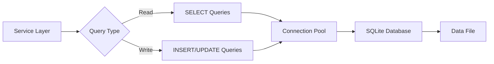
```mermaid
graph LR
    A[Service Layer] --> B{Query Type}
    B -->|Read| C[SELECT Queries]
    B -->|Write| D[INSERT/UPDATE Queries]
    C --> E[Connection Pool]
    D --> E
    E --> F[SQLite Database]
    F --> G[Data File]
```

---

## 6. 인증 및 보안 아키텍처

### 6.1 JWT 인증 플로우

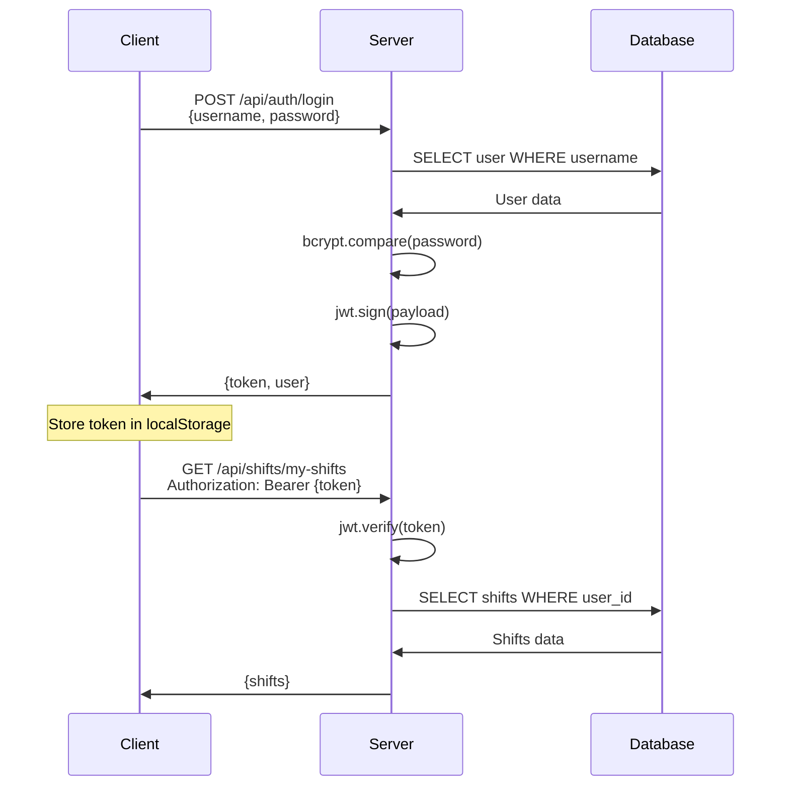
```mermaid
sequenceDiagram
    participant C as Client
    participant S as Server
    participant DB as Database
    
    C->>S: POST /api/auth/login<br/>{username, password}
    S->>DB: SELECT user WHERE username
    DB->>S: User data
    S->>S: bcrypt.compare(password)
    S->>S: jwt.sign(payload)
    S->>C: {token, user}
    
    Note over C: Store token in localStorage
    
    C->>S: GET /api/shifts/my-shifts<br/>Authorization: Bearer {token}
    S->>S: jwt.verify(token)
    S->>DB: SELECT shifts WHERE user_id
    DB->>S: Shifts data
    S->>C: {shifts}
```

### 6.2 보안 계층

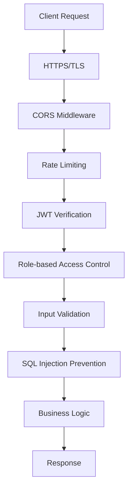
```mermaid
graph TD
    A[Client Request] --> B[HTTPS/TLS]
    B --> C[CORS Middleware]
    C --> D[Rate Limiting]
    D --> E[JWT Verification]
    E --> F[Role-based Access Control]
    F --> G[Input Validation]
    G --> H[SQL Injection Prevention]
    H --> I[Business Logic]
    I --> J[Response]
```

### 6.3 보안 조치

| 계층 | 보안 조치 | 구현 방법 |
|------|----------|----------|
| **전송 계층** | HTTPS 암호화 | Vercel/Render 자동 SSL |
| **인증** | JWT 토큰 | jsonwebtoken 라이브러리 |
| **비밀번호** | 해싱 | bcrypt (salt rounds: 10) |
| **API 보호** | Rate Limiting | express-rate-limit |
| **CORS** | 도메인 제한 | cors 미들웨어 |
| **입력 검증** | 데이터 검증 | express-validator |
| **SQL Injection** | Prepared Statements | SQLite parameterized queries |
| **XSS** | 입력 sanitization | DOMPurify (프론트엔드) |

---

## 7. API 통신 아키텍처

### 7.1 요청/응답 플로우

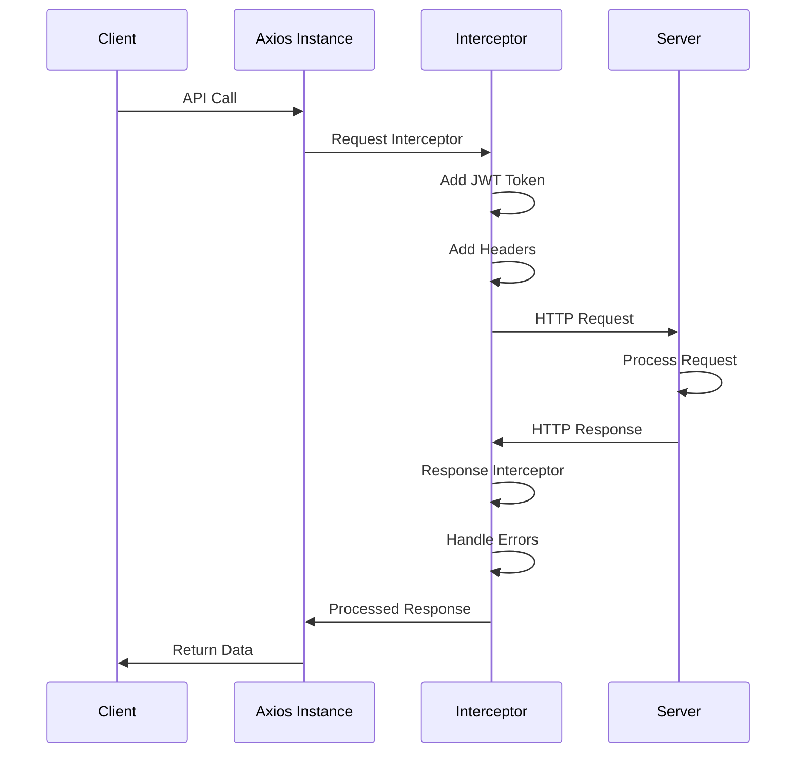
```mermaid
sequenceDiagram
    participant C as Client
    participant A as Axios Instance
    participant I as Interceptor
    participant S as Server
    
    C->>A: API Call
    A->>I: Request Interceptor
    I->>I: Add JWT Token
    I->>I: Add Headers
    I->>S: HTTP Request
    S->>S: Process Request
    S->>I: HTTP Response
    I->>I: Response Interceptor
    I->>I: Handle Errors
    I->>A: Processed Response
    A->>C: Return Data
```

### 7.2 에러 처리 전략

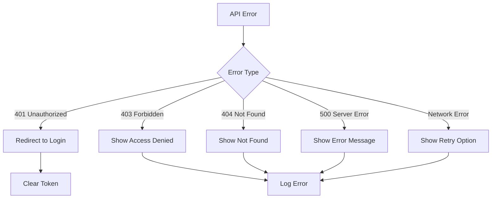
```mermaid
graph TD
    A[API Error] --> B{Error Type}
    B -->|401 Unauthorized| C[Redirect to Login]
    B -->|403 Forbidden| D[Show Access Denied]
    B -->|404 Not Found| E[Show Not Found]
    B -->|500 Server Error| F[Show Error Message]
    B -->|Network Error| G[Show Retry Option]
    C --> H[Clear Token]
    D --> I[Log Error]
    E --> I
    F --> I
    G --> I
```

### 7.3 API 응답 표준 포맷

```javascript
// 성공 응답
{
  "success": true,
  "data": { /* 실제 데이터 */ },
  "message": "작업이 성공적으로 완료되었습니다."
}

// 에러 응답
{
  "success": false,
  "error": {
    "code": "ERROR_CODE",
    "message": "사용자에게 표시할 메시지",
    "details": { /* 추가 정보 */ }
  }
}
```

---

## 8. 배포 아키텍처

### 8.1 CI/CD 파이프라인

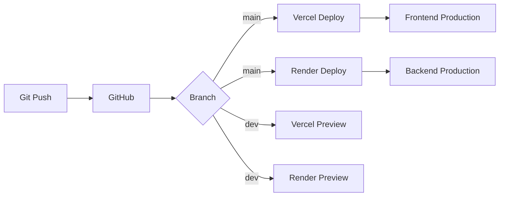
```mermaid
graph LR
    A[Git Push] --> B[GitHub]
    B --> C{Branch}
    C -->|main| D[Vercel Deploy]
    C -->|main| E[Render Deploy]
    D --> F[Frontend Production]
    E --> G[Backend Production]
    C -->|dev| H[Vercel Preview]
    C -->|dev| I[Render Preview]
```

### 8.2 환경 구성

| 환경 | Frontend | Backend | Database | 용도 |
|------|----------|---------|----------|------|
| **Development** | localhost:3000 | localhost:5000 | SQLite (local) | 로컬 개발 |
| **Staging** | Vercel Preview | Render Preview | SQLite (test) | 테스트 |
| **Production** | Vercel | Render | SQLite (prod) | 실제 서비스 |

### 8.3 환경 변수 관리

```bash
# Frontend (.env)
VITE_API_BASE_URL=https://api.example.com
VITE_APP_NAME=아르바이트 관리 시스템

# Backend (.env)
NODE_ENV=production
PORT=5000
JWT_SECRET=your-secret-key
JWT_EXPIRES_IN=24h
DATABASE_PATH=./database/production.db
CORS_ORIGIN=https://your-frontend.vercel.app
```

---

## 9. 성능 최적화 전략

### 9.1 프론트엔드 최적화

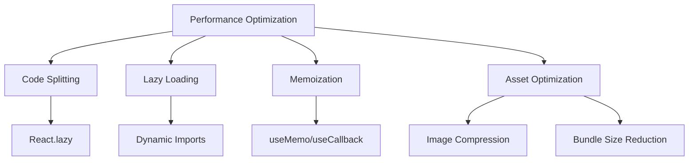
```mermaid
graph TD
    A[Performance Optimization] --> B[Code Splitting]
    A --> C[Lazy Loading]
    A --> D[Memoization]
    A --> E[Asset Optimization]
    
    B --> F[React.lazy]
    C --> G[Dynamic Imports]
    D --> H[useMemo/useCallback]
    E --> I[Image Compression]
    E --> J[Bundle Size Reduction]
```

**구현 방법**:
- **Code Splitting**: React.lazy()로 페이지별 분리
- **Lazy Loading**: 이미지 lazy loading 적용
- **Memoization**: useMemo, useCallback 활용
- **Asset Optimization**: 이미지 압축, 번들 최적화

### 9.2 백엔드 최적화

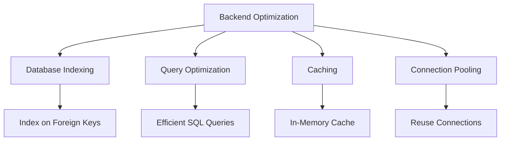
```mermaid
graph TD
    A[Backend Optimization] --> B[Database Indexing]
    A --> C[Query Optimization]
    A --> D[Caching]
    A --> E[Connection Pooling]
    
    B --> F[Index on Foreign Keys]
    C --> G[Efficient SQL Queries]
    D --> H[In-Memory Cache]
    E --> I[Reuse Connections]
```

**구현 방법**:
- **Database Indexing**: 자주 조회되는 컬럼에 인덱스
- **Query Optimization**: N+1 문제 방지, JOIN 최적화
- **Caching**: 통계 데이터 캐싱 (추후 Redis 도입)
- **Connection Pooling**: DB 연결 재사용

### 9.3 네트워크 최적화

- **HTTP/2**: Vercel, Render 기본 지원
- **Compression**: gzip/brotli 압축 적용
- **CDN**: Vercel Edge Network 활용
- **API Response Size**: 필요한 데이터만 반환

---

## 10. 모니터링 및 로깅

### 10.1 로깅 전략

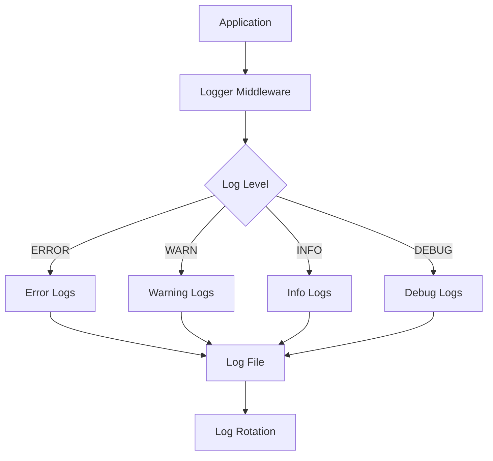
```mermaid
graph TD
    A[Application] --> B[Logger Middleware]
    B --> C{Log Level}
    C -->|ERROR| D[Error Logs]
    C -->|WARN| E[Warning Logs]
    C -->|INFO| F[Info Logs]
    C -->|DEBUG| G[Debug Logs]
    
    D --> H[Log File]
    E --> H
    F --> H
    G --> H
    
    H --> I[Log Rotation]
```

**로그 레벨**:
- **ERROR**: 시스템 에러, 예외 상황
- **WARN**: 경고, 잠재적 문제
- **INFO**: 일반 정보, API 호출 기록
- **DEBUG**: 디버깅 정보 (개발 환경만)

### 10.2 모니터링 지표

| 지표 | 설명 | 목표 |
|------|------|------|
| **응답 시간** | API 평균 응답 시간 | < 500ms |
| **에러율** | 전체 요청 대비 에러 비율 | < 1% |
| **가동 시간** | 시스템 가동률 | > 99% |
| **동시 사용자** | 동시 접속 사용자 수 | 50명 지원 |
| **DB 쿼리 시간** | 평균 쿼리 실행 시간 | < 100ms |

---

## 11. 확장성 고려사항

### 11.1 수평 확장 (Horizontal Scaling)

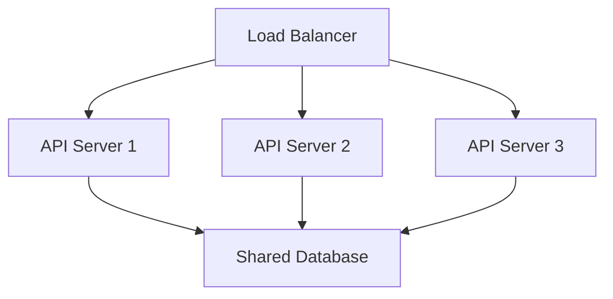
```mermaid
graph TD
    A[Load Balancer] --> B[API Server 1]
    A --> C[API Server 2]
    A --> D[API Server 3]
    B --> E[Shared Database]
    C --> E
    D --> E
```

**확장 시나리오**:
1. **단계 1 (현재)**: 단일 서버 (Render 무료 티어)
2. **단계 2**: Render 유료 티어로 업그레이드
3. **단계 3**: 로드 밸런서 + 다중 인스턴스
4. **단계 4**: 마이크로서비스 아키텍처 전환

### 11.2 데이터베이스 확장

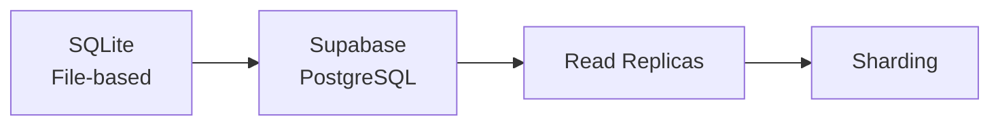
```mermaid
graph LR
    A[SQLite<br/>File-based] --> B[Supabase<br/>PostgreSQL]
    B --> C[Read Replicas]
    C --> D[Sharding]
```

**마이그레이션 경로**:
1. **Phase 1**: SQLite (MVP, ~100 사용자)
2. **Phase 2**: Supabase PostgreSQL (~1,000 사용자)
3. **Phase 3**: Read Replicas (읽기 성능 향상)
4. **Phase 4**: Sharding (대규모 확장)

### 11.3 캐싱 전략

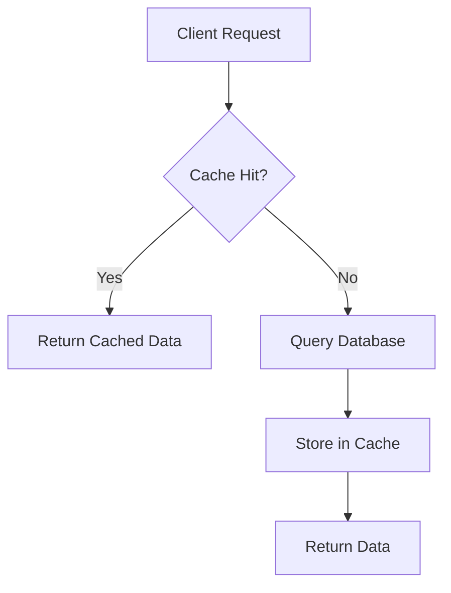
```mermaid
graph TD
    A[Client Request] --> B{Cache Hit?}
    B -->|Yes| C[Return Cached Data]
    B -->|No| D[Query Database]
    D --> E[Store in Cache]
    E --> F[Return Data]
```

**캐싱 대상**:
- 사용자 정보 (TTL: 1시간)
- 월별 통계 (TTL: 1일)
- 승인된 근무 기록 (TTL: 1시간)

---

## 12. 재해 복구 및 백업

### 12.1 백업 전략

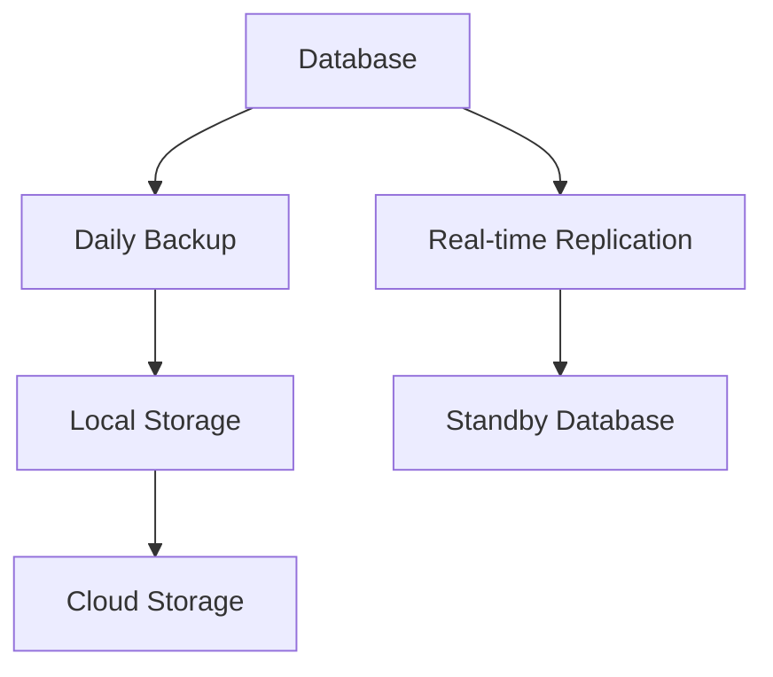
```mermaid
graph TD
    A[Database] --> B[Daily Backup]
    B --> C[Local Storage]
    C --> D[Cloud Storage]
    
    A --> E[Real-time Replication]
    E --> F[Standby Database]
```

**백업 계획**:
- **빈도**: 매일 자동 백업
- **보관 기간**: 30일
- **저장 위치**: Render 볼륨 + 외부 스토리지
- **복구 테스트**: 월 1회

### 12.2 장애 대응

| 장애 유형 | 대응 방안 | 복구 시간 목표 (RTO) |
|----------|----------|---------------------|
| **Frontend 장애** | Vercel 자동 복구 | < 5분 |
| **Backend 장애** | Render 자동 재시작 | < 10분 |
| **Database 손상** | 백업에서 복구 | < 1시간 |
| **전체 시스템 장애** | 재배포 | < 2시간 |

---

## 13. 보안 아키텍처 상세

### 13.1 인증 토큰 관리

```javascript
// JWT Payload 구조
{
  "userId": 1,
  "username": "staff01",
  "role": "staff",
  "iat": 1696234800,  // 발급 시간
  "exp": 1696321200   // 만료 시간 (24시간 후)
}
```

### 13.2 권한 관리 (RBAC)

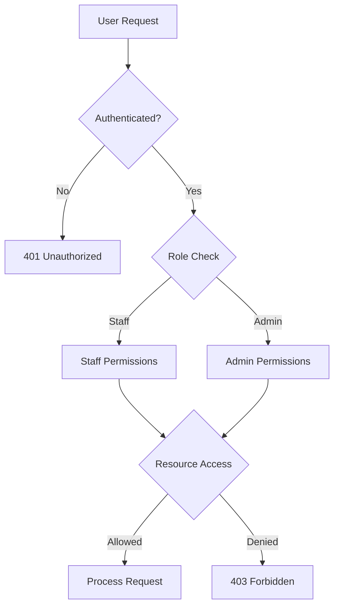
```mermaid
graph TD
    A[User Request] --> B{Authenticated?}
    B -->|No| C[401 Unauthorized]
    B -->|Yes| D{Role Check}
    D -->|Staff| E[Staff Permissions]
    D -->|Admin| F[Admin Permissions]
    E --> G{Resource Access}
    F --> G
    G -->|Allowed| H[Process Request]
    G -->|Denied| I[403 Forbidden]
```

**권한 매트릭스**:

| 기능 | Staff | Admin |
|------|-------|-------|
| 출근/퇴근 기록 | ✅ | ✅ |
| 내 근무 내역 조회 | ✅ | ✅ |
| 전체 근무 기록 조회 | ❌ | ✅ |
| 승인/반려 | ❌ | ✅ |
| 통계 조회 | ❌ | ✅ |
| 사용자 관리 | ❌ | ✅ |

---

## 14. 기술 스택 상세

### 14.1 프론트엔드 스택

```
React 18.2+
├── React Router v6          # 라우팅
├── Axios                    # HTTP 클라이언트
├── Tailwind CSS             # 스타일링
├── React Hook Form          # 폼 관리
├── date-fns                 # 날짜 처리
├── React Icons              # 아이콘
└── Vite                     # 빌드 도구
```

### 14.2 백엔드 스택

```
Node.js 18+
├── Express.js 4.18+         # 웹 프레임워크
├── jsonwebtoken             # JWT 인증
├── bcrypt                   # 비밀번호 해싱
├── sqlite3                  # SQLite 드라이버
├── express-validator        # 입력 검증
├── cors                     # CORS 처리
├── helmet                   # 보안 헤더
├── express-rate-limit       # Rate limiting
└── morgan                   # 로깅
```

### 14.3 개발 도구

```
Development Tools
├── ESLint                   # 코드 린팅
├── Prettier                 # 코드 포맷팅
├── Husky                    # Git hooks
├── Jest                     # 테스트 프레임워크
├── Postman                  # API 테스트
└── Git                      # 버전 관리
```

---

## 15. 데이터 플로우

### 15.1 출근 기록 플로우

```mermaid
sequenceDiagram
    participant U as User
    participant F as Frontend
    participant A as API Server
    participant D as Database
    
    U->>F: 출근하기 버튼 클릭
    F->>F: 현재 시간 가져오기
    F->>A: POST /api/shifts/clock-in<br/>{memo}
    A->>A: JWT 검증
    A->>A: 중복 체크 (오늘 이미 출근?)
    A->>D: INSERT INTO shifts
    D->>A: 생성된 shift 데이터
    A->>F: {success, shift}
    F->>U: 출근 완료 메시지 표시
```

### 15.2 승인 처리 플로우

```mermaid
sequenceDiagram
    participant A as Admin
    participant F as Frontend
    participant S as API Server
    participant D as Database
    
    A->>F: 승인 버튼 클릭
    F->>S: PUT /api/admin/shifts/:id/approve
    S->>S: JWT 검증
    S->>S: 관리자 권한 확인
    S->>D: UPDATE shifts SET status='approved'
    D->>S: 업데이트 완료
    S->>F: {success, message}
    F->>A: 승인 완료 메시지 표시
    F->>F: 리스트 새로고침
```

---

## 16. 테스트 전략

### 16.1 테스트 피라미드

```mermaid
graph TD
    A[E2E Tests<br/>10%] --> B[Integration Tests<br/>30%]
    B --> C[Unit Tests<br/>60%]
```

### 16.2 테스트 범위

| 테스트 유형 | 도구 | 대상 | 커버리지 목표 |
|------------|------|------|--------------|
| **Unit Tests** | Jest | 함수, 유틸리티 | 80% |
| **Integration Tests** | Jest + Supertest | API 엔드포인트 | 70% |
| **E2E Tests** | Cypress | 주요 사용자 플로우 | 주요 기능 |
| **Manual Tests** | - | UI/UX | 배포 전 |

---

## 17. 마이그레이션 계획

### 17.1 SQLite → Supabase 마이그레이션

```mermaid
graph LR
    A[SQLite DB] --> B[Export Data]
    B --> C[Transform Schema]
    C --> D[Import to Supabase]
    D --> E[Verify Data]
    E --> F[Update Connection]
    F --> G[Deploy]
```

**마이그레이션 체크리스트**:
- [ ] 데이터 백업
- [ ] Supabase 프로젝트 생성
- [ ] 스키마 마이그레이션
- [ ] 데이터 이전
- [ ] 연결 문자열 업데이트
- [ ] 테스트
- [ ] 배포

---

## 18. 참고 아키텍처 패턴

### 18.1 현재 아키텍처 (Monolithic)

```
┌─────────────────────────────────┐
│     Monolithic Application      │
│  ┌──────────┐  ┌──────────┐    │
│  │  Auth    │  │  Shifts  │    │
│  └──────────┘  └──────────┘    │
│  ┌──────────┐  ┌──────────┐    │
│  │  Admin   │  │  Stats   │    │
│  └──────────┘  └──────────┘    │
└─────────────────────────────────┘
```

### 18.2 미래 아키텍처 (Microservices)

```
┌──────────┐  ┌──────────┐  ┌──────────┐
│   Auth   │  │  Shifts  │  │  Admin   │
│ Service  │  │ Service  │  │ Service  │
└──────────┘  └──────────┘  └──────────┘
      │             │             │
      └─────────────┴─────────────┘
                    │
              ┌──────────┐
              │ API      │
              │ Gateway  │
              └──────────┘
```

---

## 19. 변경 이력

| 버전 | 날짜 | 변경 내용 | 작성자 |
|------|------|----------|--------|
| 1.0.0 | 2025-10-02 | 초안 작성 | - |

---

**문서 종료**
