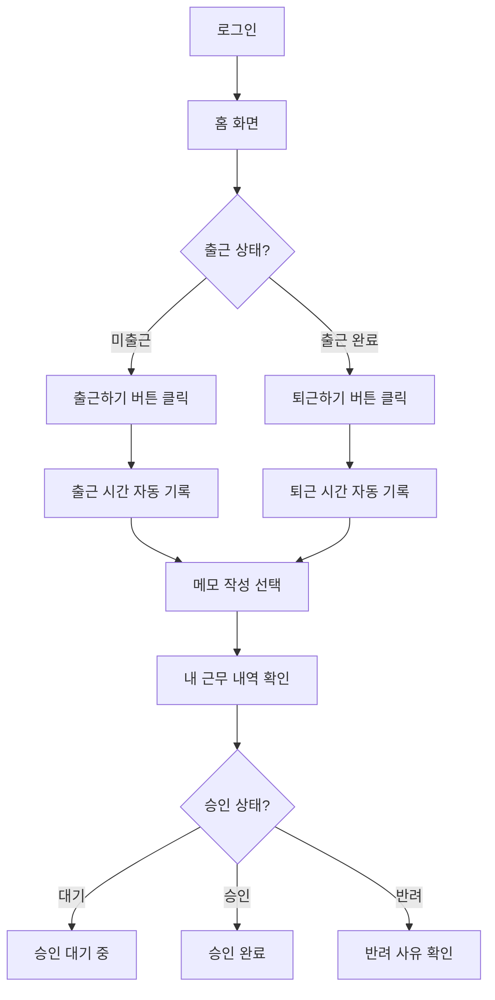
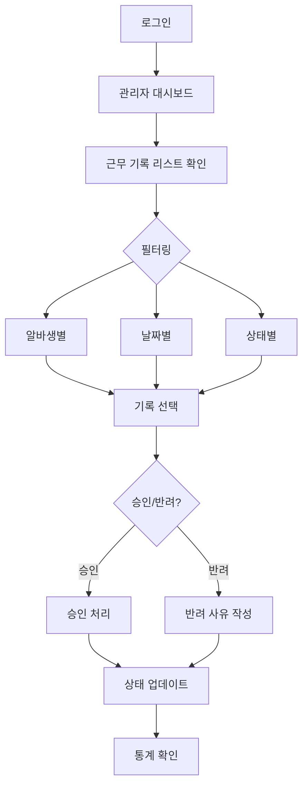
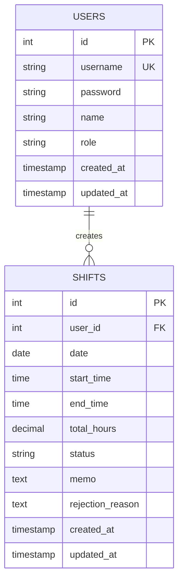

# PRD: 아르바이트 출퇴근 관리 시스템

## 📋 문서 정보
- **프로젝트명**: 아르바이트 출퇴근 관리 시스템
- **버전**: 1.0.0
- **작성일**: 2025-10-02
- **문서 상태**: MVP 기획

---

## 1. 프로젝트 개요

### 1.1 목적
알바생이 스스로 출퇴근 시간과 근무 시간을 기록하고, 관리자가 이를 확인하여 승인할 수 있는 웹 기반 근태 관리 시스템을 구축한다.

### 1.2 배경 및 문제점
- **현재 문제**: 종이 기반 출퇴근 기록으로 인한 관리의 비효율성
- **분실 위험**: 수기 기록의 분실 및 위변조 가능성
- **검증 어려움**: 근무 시간 검증 및 급여 계산의 복잡성

### 1.3 핵심 가치 제안
- ✅ **전자화**: 종이 대신 디지털 기록으로 관리 효율성 증가
- ✅ **신뢰성**: 관리자 승인 프로세스를 통한 근무 시간 검증
- ✅ **투명성**: 알바생과 관리자 모두 실시간 근무 내역 확인 가능
- ✅ **무료**: 비용 최소화를 통한 소규모 사업장 적용 가능

### 1.4 목표 사용자
| 사용자 그룹 | 역할 | 주요 니즈 |
|------------|------|----------|
| **알바생 (Staff)** | 근무자 | 간편한 출퇴근 기록, 근무 내역 확인 |
| **관리자 (Admin)** | 관리자 | 근무 기록 검증, 승인/반려, 통계 확인 |

---

## 2. 기능 요구사항

### 2.1 알바생 (Staff) 기능

#### 2.1.1 인증
- **로그인**: ID/PW 기반 로그인
- **세션 유지**: 자동 로그인 옵션 (선택)

#### 2.1.2 출퇴근 기록
- **출근하기**: 버튼 클릭 시 현재 시간 자동 기록
- **퇴근하기**: 버튼 클릭 시 현재 시간 자동 기록
- **수동 입력**: 누락된 출퇴근 시간 수동 입력 가능
- **메모 작성**: 근무 중 특이사항 메모 (선택 사항)

#### 2.1.3 근무 내역 조회
- **내 근무 내역**: 날짜별 출퇴근 시간, 총 근무시간 확인
- **상태 표시**: 승인 대기/승인 완료/반려 상태 표시
- **반려 사유 확인**: 반려된 경우 관리자의 반려 사유 확인

### 2.2 관리자 (Admin) 기능

#### 2.2.1 인증
- **로그인**: 관리자 계정으로 로그인

#### 2.2.2 근무 기록 관리
- **전체 기록 조회**: 모든 알바생의 근무 기록 리스트 확인
- **필터링**: 알바생별, 날짜별, 상태별 필터링
- **승인 처리**: 근무 기록 승인
- **반려 처리**: 근무 기록 반려 + 사유 작성 (선택)

#### 2.2.3 통계 및 리포트
- **월별 통계**: 알바생별 월 근무 시간 합계
- **근무 현황**: 승인 대기 중인 기록 수 확인

---

## 3. 사용자 플로우

### 3.1 알바생 플로우



### 3.2 관리자 플로우



---

## 4. 화면 설계 (Wireframe)

### 4.1 알바생 화면

#### 4.1.1 홈 화면
```
┌─────────────────────────────────┐
│  🏠 홈                          │
├─────────────────────────────────┤
│  안녕하세요, [이름]님!          │
│                                 │
│  📅 오늘 날짜: 2025-10-02      │
│  ⏰ 현재 시간: 10:33           │
│                                 │
│  ┌───────────────────────────┐ │
│  │   🟢 출근하기             │ │
│  └───────────────────────────┘ │
│                                 │
│  ┌───────────────────────────┐ │
│  │   🔴 퇴근하기             │ │
│  └───────────────────────────┘ │
│                                 │
│  오늘 근무 상태:                │
│  출근: 09:00 | 퇴근: -          │
│                                 │
│  📝 메모 (선택):                │
│  ┌───────────────────────────┐ │
│  │                           │ │
│  └───────────────────────────┘ │
│                                 │
│  [내 근무 내역 보기]            │
└─────────────────────────────────┘
```

#### 4.1.2 내 근무 내역
```
┌─────────────────────────────────┐
│  📊 내 근무 내역                │
├─────────────────────────────────┤
│  날짜       출근   퇴근   시간   │
│  2025-10-01 09:00 18:00 9h ✅  │
│  2025-09-30 10:00 19:00 9h ✅  │
│  2025-09-29 09:30 18:30 9h ⏳  │
│  2025-09-28 09:00 17:00 8h ❌  │
│    └ 반려 사유: 출근 시간 확인 │
│                                 │
│  ✅ 승인 완료                   │
│  ⏳ 승인 대기                   │
│  ❌ 반려                        │
└─────────────────────────────────┘
```

### 4.2 관리자 화면

#### 4.2.1 근무 기록 리스트
```
┌─────────────────────────────────────────────┐
│  👔 관리자 대시보드                         │
├─────────────────────────────────────────────┤
│  필터: [전체 알바생 ▼] [2025-10 ▼] [대기 ▼]│
│                                             │
│  이름    날짜       출근   퇴근   시간  상태│
│  김철수  2025-10-01 09:00 18:00 9h   ⏳   │
│         [승인] [반려]                       │
│  이영희  2025-10-01 10:00 19:00 9h   ⏳   │
│         [승인] [반려]                       │
│  박민수  2025-09-30 09:30 18:30 9h   ✅   │
│                                             │
│  승인 대기: 2건                             │
└─────────────────────────────────────────────┘
```

#### 4.2.2 통계 화면
```
┌─────────────────────────────────┐
│  📈 월별 근무 통계              │
├─────────────────────────────────┤
│  기간: 2025년 10월              │
│                                 │
│  이름      총 근무시간  승인률  │
│  김철수    180h        95%      │
│  이영희    160h        100%     │
│  박민수    170h        90%      │
│                                 │
│  전체 합계: 510h                │
└─────────────────────────────────┘
```

---

## 5. 기술 스택

### 5.1 프론트엔드
- **프레임워크**: React 18+
- **상태 관리**: React Context API / Zustand
- **스타일링**: Tailwind CSS
- **라우팅**: React Router v6
- **HTTP 클라이언트**: Axios

### 5.2 백엔드
- **런타임**: Node.js 18+
- **프레임워크**: Express.js
- **인증**: JWT (JSON Web Token)
- **비밀번호 암호화**: bcrypt

### 5.3 데이터베이스
- **MVP**: SQLite (파일 기반)
- **확장**: Supabase (PostgreSQL, 무료 티어)

### 5.4 배포 및 호스팅
- **프론트엔드**: Vercel (무료 티어)
- **백엔드**: Render (무료 티어)
- **버전 관리**: GitHub

### 5.5 개발 도구
- **IDE**: Windsurf
- **API 테스트**: Postman / Thunder Client
- **문서 관리**: Notion / Google Docs

---

## 6. 데이터베이스 스키마

### 6.1 Users 테이블
```sql
CREATE TABLE users (
  id INTEGER PRIMARY KEY AUTOINCREMENT,
  username VARCHAR(50) UNIQUE NOT NULL,
  password VARCHAR(255) NOT NULL,
  name VARCHAR(100) NOT NULL,
  role VARCHAR(20) NOT NULL CHECK(role IN ('staff', 'admin')),
  created_at TIMESTAMP DEFAULT CURRENT_TIMESTAMP,
  updated_at TIMESTAMP DEFAULT CURRENT_TIMESTAMP
);
```

### 6.2 Shifts 테이블
```sql
CREATE TABLE shifts (
  id INTEGER PRIMARY KEY AUTOINCREMENT,
  user_id INTEGER NOT NULL,
  date DATE NOT NULL,
  start_time TIME NOT NULL,
  end_time TIME,
  total_hours DECIMAL(4,2),
  status VARCHAR(20) DEFAULT 'pending' CHECK(status IN ('pending', 'approved', 'rejected')),
  memo TEXT,
  rejection_reason TEXT,
  created_at TIMESTAMP DEFAULT CURRENT_TIMESTAMP,
  updated_at TIMESTAMP DEFAULT CURRENT_TIMESTAMP,
  FOREIGN KEY (user_id) REFERENCES users(id) ON DELETE CASCADE
);
```

### 6.3 ERD


---

## 7. API 명세

### 7.1 인증 API

#### POST /api/auth/login
**요청**
```json
{
  "username": "staff01",
  "password": "password123"
}
```
**응답**
```json
{
  "success": true,
  "token": "eyJhbGciOiJIUzI1NiIsInR5cCI6IkpXVCJ9...",
  "user": {
    "id": 1,
    "username": "staff01",
    "name": "김철수",
    "role": "staff"
  }
}
```

#### POST /api/auth/logout
**응답**
```json
{
  "success": true,
  "message": "로그아웃 성공"
}
```

### 7.2 출퇴근 기록 API (알바생)

#### POST /api/shifts/clock-in
**요청**
```json
{
  "memo": "오늘 재고 정리 예정"
}
```
**응답**
```json
{
  "success": true,
  "shift": {
    "id": 123,
    "date": "2025-10-02",
    "start_time": "10:33:00",
    "status": "pending"
  }
}
```

#### PUT /api/shifts/clock-out/:id
**요청**
```json
{
  "memo": "재고 정리 완료"
}
```
**응답**
```json
{
  "success": true,
  "shift": {
    "id": 123,
    "date": "2025-10-02",
    "start_time": "10:33:00",
    "end_time": "19:00:00",
    "total_hours": 8.45,
    "status": "pending"
  }
}
```

#### GET /api/shifts/my-shifts
**쿼리 파라미터**: `?month=2025-10`
**응답**
```json
{
  "success": true,
  "shifts": [
    {
      "id": 123,
      "date": "2025-10-01",
      "start_time": "09:00:00",
      "end_time": "18:00:00",
      "total_hours": 9.0,
      "status": "approved",
      "memo": "정상 근무"
    }
  ]
}
```

### 7.3 근무 관리 API (관리자)

#### GET /api/admin/shifts
**쿼리 파라미터**: `?user_id=1&month=2025-10&status=pending`
**응답**
```json
{
  "success": true,
  "shifts": [
    {
      "id": 123,
      "user": {
        "id": 1,
        "name": "김철수"
      },
      "date": "2025-10-01",
      "start_time": "09:00:00",
      "end_time": "18:00:00",
      "total_hours": 9.0,
      "status": "pending",
      "memo": "정상 근무"
    }
  ]
}
```

#### PUT /api/admin/shifts/:id/approve
**응답**
```json
{
  "success": true,
  "message": "근무 기록이 승인되었습니다."
}
```

#### PUT /api/admin/shifts/:id/reject
**요청**
```json
{
  "rejection_reason": "출근 시간 확인 필요"
}
```
**응답**
```json
{
  "success": true,
  "message": "근무 기록이 반려되었습니다."
}
```

#### GET /api/admin/statistics
**쿼리 파라미터**: `?month=2025-10`
**응답**
```json
{
  "success": true,
  "statistics": [
    {
      "user_id": 1,
      "name": "김철수",
      "total_hours": 180.0,
      "approved_hours": 171.0,
      "approval_rate": 95.0
    }
  ]
}
```

---

## 8. 비기능 요구사항

### 8.1 성능
- **응답 시간**: API 응답 시간 < 500ms
- **동시 사용자**: 최소 50명 동시 접속 지원

### 8.2 보안
- **비밀번호 암호화**: bcrypt 사용 (salt rounds: 10)
- **JWT 토큰**: 만료 시간 24시간
- **HTTPS**: 프로덕션 환경에서 HTTPS 필수
- **SQL Injection 방지**: Prepared Statements 사용

### 8.3 사용성
- **반응형 디자인**: 모바일/태블릿/데스크톱 지원
- **직관적 UI**: 최소한의 클릭으로 주요 기능 접근
- **에러 메시지**: 명확하고 이해하기 쉬운 에러 메시지

### 8.4 유지보수성
- **코드 구조**: 컴포넌트 기반 설계
- **주석**: 주요 로직에 주석 추가
- **버전 관리**: Git을 통한 체계적인 버전 관리

---

## 9. 비용 최소화 전략

| 항목 | 도구/서비스 | 비용 |
|------|------------|------|
| 프론트엔드 호스팅 | Vercel | 무료 티어 |
| 백엔드 호스팅 | Render | 무료 티어 |
| 데이터베이스 | SQLite → Supabase | 무료 |
| 인증 | JWT → Firebase Auth | 무료 티어 |
| 버전 관리 | GitHub | 무료 |
| 문서 관리 | Notion / Google Docs | 무료 |
| 도메인 | Vercel 제공 도메인 | 무료 |

**총 예상 비용**: **$0/월** (무료 티어 범위 내)

---

## 10. 개발 로드맵

### Phase 1: MVP 개발 (2주)
- ✅ 프로젝트 초기 설정
- ✅ 데이터베이스 스키마 설계
- ✅ 인증 시스템 구현 (로그인/로그아웃)
- ✅ 알바생 출퇴근 기록 기능
- ✅ 관리자 승인/반려 기능
- ✅ 기본 UI 구현

### Phase 2: 배포 및 테스트 (1주)
- ✅ Vercel 프론트엔드 배포
- ✅ Render 백엔드 배포
- ✅ 통합 테스트
- ✅ 버그 수정

### Phase 3: 개선 및 확장 (진행 중)
- 🔄 통계 대시보드 고도화
- 🔄 모바일 최적화
- 🔄 알림 기능 추가
- 🔄 급여 계산 자동화

---

## 11. 향후 확장 가능성

### 11.1 단기 확장 (3개월 이내)
- **근무표 편성**: 주간/월간 근무 스케줄 관리
- **알림 기능**: 출퇴근 누락 시 알림 (이메일/푸시)
- **엑셀 내보내기**: 근무 기록 Excel 다운로드

### 11.2 중기 확장 (6개월 이내)
- **급여 계산**: 근무시간 × 시급 자동 계산
- **휴가 관리**: 연차/반차 신청 및 승인
- **다중 사업장**: 여러 사업장 관리 지원

### 11.3 장기 확장 (1년 이내)
- **모바일 앱**: React Native 기반 네이티브 앱
- **생체 인증**: 지문/얼굴 인식 출퇴근
- **AI 분석**: 근무 패턴 분석 및 인사이트 제공

---

## 12. 리스크 및 대응 방안

| 리스크 | 영향도 | 대응 방안 |
|--------|--------|----------|
| 무료 티어 제한 초과 | 중 | 사용량 모니터링, 필요시 유료 전환 |
| 데이터 손실 | 높음 | 정기 백업, Supabase 자동 백업 활용 |
| 보안 취약점 | 높음 | 정기 보안 점검, HTTPS 적용 |
| 사용자 채택 저조 | 중 | 사용자 피드백 수집, UI/UX 개선 |

---

## 13. 성공 지표 (KPI)

- **사용자 수**: 월 활성 사용자 50명 이상
- **출퇴근 기록률**: 90% 이상
- **승인 처리 시간**: 평균 24시간 이내
- **시스템 가동률**: 99% 이상
- **사용자 만족도**: 4.0/5.0 이상

---

## 14. 참고 자료

- [React 공식 문서](https://react.dev/)
- [Express.js 공식 문서](https://expressjs.com/)
- [Vercel 배포 가이드](https://vercel.com/docs)
- [Render 배포 가이드](https://render.com/docs)
- [SQLite 문서](https://www.sqlite.org/docs.html)

---

## 15. 변경 이력

| 버전 | 날짜 | 변경 내용 | 작성자 |
|------|------|----------|--------|
| 1.0.0 | 2025-10-02 | 초안 작성 | - |

---

**문서 종료**
